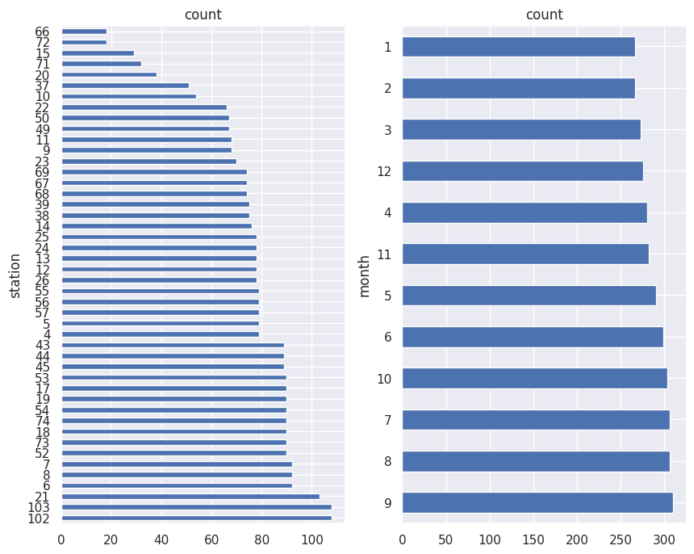
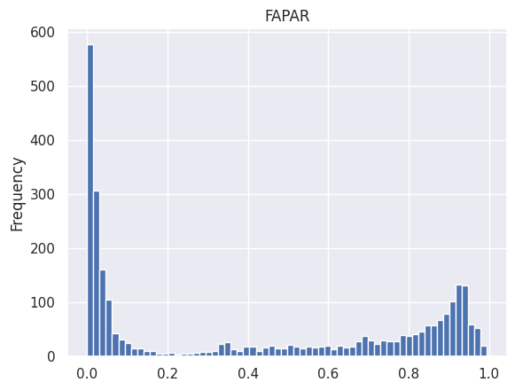
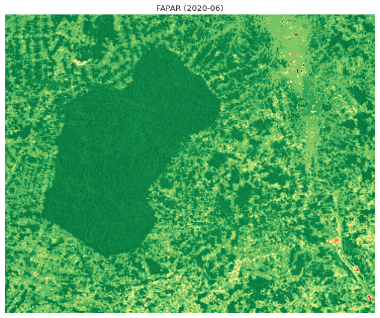

# Geo-AutoML with Scikit-map

This tutorial presents a modeling strategy for [Fraction of Absorbed Photosynthetically Active Radiation (FAPAR)](https://doi.org/10.7717/peerj.16972) using in-situ data and based on Automated Machine Learning (AutoML), including a example of spatial prediction and model output saved as raster data.

The dataset presented here was prepared within the context of [OEMC Hackthon 2023](https://earthmonitor.org/events/hackathon2023/). The Open-Earth-Monitor Cyberinfrastructure project has received funding from the European Union's Horizon Europe research and innovation programme under grant agreement No. 101059548.

# Installing libraries

It's possible to use `pip` for installing [Scikit-map](https://github.com/openlandmap/scikit-map):


```python
#!pip install -e 'git+https://github.com/openlandmap/scikit-map#egg=scikit-map[full]'
```

and [EvalML](https://github.com/alteryx/evalml):


```python
#!pip install evalml
#!pip install premium-primitives
```

# Data downloading

First, let's download the [FAPAR dataset](https://zenodo.org/records/13874505) from Zenodo using [Requests](https://pypi.org/project/requests/):


```python
import requests

zenodo_url = 'https://zenodo.org/records/13874505'
train_url = f'{zenodo_url}/files/train.csv?download=1'

r_train = requests.get(train_url, allow_redirects=True)
f_train = 'train.csv'

print(f"Downloading {f_train}")
open(f_train, 'wb').write(r_train.content)
```

    Downloading train.csv


    794104


For enabling spatial predictions it's necessary extract the file `raster_data_2020.zip`:


```python
import zipfile
import os

raster_url = f'{zenodo_url}/files/raster_data_2020.zip?download=1'

r_raster = requests.get(raster_url, allow_redirects=True)
f_raster = 'raster_data_2020.zip'

print(f"Downloading & extracting {f_raster}")
open(f_raster, 'wb').write(r_raster.content)

with zipfile.ZipFile(f_raster,"r") as zip_ref:
    zip_ref.extractall(".")
    os.unlink(f_raster)
```

    Downloading & extracting raster_data_2020.zip


# Data reading

Now, let's load the train set using [Pandas](https://pandas.pydata.org/),


```python
import pandas as pd

f_train = 'train.csv'
df_train = pd.read_csv(f_train)

print(f"df_train shape={df_train.shape}")
```

    df_train shape=(3461, 36)


... and check all columns available:


```python
print("Columns:")
for i, c, t in zip(range(0, df_train.shape[0]), df_train.columns, df_train.dtypes):
    print(f' - {i}: {c} ({t})')
```

    Columns:
     - 0: sample_id (int64)
     - 1: station (int64)
     - 2: month (int64)
     - 3: fapar (float64)
     - 4: modis_blue (float64)
     - 5: modis_red (float64)
     - 6: modis_nir (float64)
     - 7: modis_mir (float64)
     - 8: modis_evi (float64)
     - 9: modis_ndvi (float64)
     - 10: modis_lst_day_p05 (float64)
     - 11: modis_lst_day_p50 (float64)
     - 12: modis_lst_day_p95 (float64)
     - 13: modis_lst_night_p05 (float64)
     - 14: modis_lst_night_p50 (float64)
     - 15: modis_lst_night_p95 (float64)
     - 16: wv_yearly_p25 (float64)
     - 17: wv_yearly_p50 (float64)
     - 18: wv_yearly_p75 (float64)
     - 19: wv_monthly_lt_p50 (float64)
     - 20: wv_monthly_lt_p25 (float64)
     - 21: wv_monthly_lt_p75 (float64)
     - 22: wv_monthly_lt_sd (float64)
     - 23: wv_monthly_ts_raw (float64)
     - 24: wv_monthly_ts_smooth (float64)
     - 25: accum_pr_monthly (float64)
     - 26: dtm_slope (float64)
     - 27: dtm_aspect-cosine (float64)
     - 28: dtm_aspect-sine (float64)
     - 29: dtm_downlslope.curvature (float64)
     - 30: dtm_upslope.curvature (float64)
     - 31: dtm_elevation (float64)
     - 32: dtm_cti (float64)
     - 33: dtm_neg.openess (float64)
     - 34: dtm_pos.openess (float64)
     - 35: dtm_vbf (float64)


What exactly is station and month?
- **Station**: Unique spatial in-situ location for where FAPAR was estimated (see [GBOV](https://land.copernicus.eu/en/products/GBOV))
- **Month**: Specific month where FAPAR was estimated


```python
import matplotlib.pyplot as plt
import seaborn as sns
sns.set_theme(context='notebook')

fig, axes = plt.subplots(nrows=1,ncols=2, figsize=(10,8))

df_train['station'].value_counts().plot(kind='barh', ax = axes[0], subplots=True)
df_train['month'].value_counts().plot(kind='barh', ax = axes[1], subplots=True)
;
```


    ''


    

    


Let's get the _features/covariates_, _target_ and _spatial cross-validation_ columns: 


```python
covs = list(df_train.columns[4:])
target = 'fapar'
cv_group_col = 'station'
```

For the calibration set (early stopping), let's randomly select data from **20%** of the station:


```python
calib_groups = pd.DataFrame(df_train[cv_group_col].unique()).sample(frac=0.2).iloc[:,0].to_numpy()

df_calib = df_train[df_train[cv_group_col].isin(calib_groups)]
df_train = df_train.drop(index=df_calib.index)

print(f"df_train shape={df_train.shape}")
print(f"df_calib shape={df_calib.shape}")
```

    df_train shape=(2841, 36)
    df_calib shape=(620, 36)


# Data checks

The FAPAR dataset is ready for modeling, so it has no NA values or missing columns, but it's possible to use [EvalML for several data check](https://evalml.alteryx.com/en/stable/user_guide/data_checks.html):


```python
from evalml.data_checks import NullDataCheck

# Simulate rows & column with null
# df_train.loc[df_train.sample(frac=0.03).index, ['modis_evi']] = np.nan
# df_train.loc[df_train.sample(frac=0.01).index, ['dtm_slope']] = np.nan

null_check = NullDataCheck(pct_moderately_null_col_threshold=0.02, pct_null_col_threshold=0.05, pct_null_row_threshold=0.01)
validation = null_check.validate(df_train)

for warning in [msg for msg in validation if msg["level"] == "warning"]:
    print("Warning:", warning["message"])

for error in [msg for msg in validation if msg["level"] == "error"]:
    print("Error:", error["message"])
```

    2025-06-19 21:56:40,282 featuretools - WARNING    Featuretools failed to load "premium_primitives" primitives from "premium_primitives". For a full stack trace, set logging to debug.


Including target distribution check:


```python
from scipy.stats import lognorm
from evalml.data_checks import TargetDistributionDataCheck

#data = np.tile(np.arange(10) * 0.01, (100, 10))
#X = pd.DataFrame(data=data)
#y = pd.Series(lognorm.rvs(s=0.4, loc=1, scale=1, size=100))

target_dist_check = TargetDistributionDataCheck()
validation = target_dist_check.validate(df_train[covs], df_train[target])

for warning in [msg for msg in validation if msg["level"] == "warning"]:
    print("Warning:", warning["message"])

for error in [msg for msg in validation if msg["level"] == "error"]:
    print("Error:", error["message"])
```

    Warning: Target may have a lognormal distribution.


Let's plot target distribution:


```python
df_train[target].plot(kind='hist', bins=64, title='FAPAR')
```


    <Axes: title={'center': 'FAPAR'}, ylabel='Frequency'>


    

    


# Automated Modeling

AutoML is the process of automating the construction, training and evaluation of ML models. Given a data and some configuration, AutoML searches for the most effective and accurate ML model or models to fit the dataset. During the search, AutoML will explore different combinations of model type, model parameters and model architecture ([see more information](https://evalml.alteryx.com/en/stable/user_guide/automl.html#Automated-Machine-Learning-(AutoML)-Search)):


```python
from evalml.problem_types import detect_problem_type
from evalml.automl import get_default_primary_search_objective

problem_type = detect_problem_type(df_train[target]).name

search_params = {
    'X_train': df_train[covs],
    'y_train': df_train[target],
    'X_holdout': df_calib[covs],
    'y_holdout': df_calib[target],
    'problem_type': problem_type,
    'objective': get_default_primary_search_objective(problem_type),
    'optimize_thresholds': True,
    'verbose': True,
    'max_iterations': 10
}

```

For enabling plot visualization in Google Colab:


```python
# Only for Google Colab
# from google.colab import output
# output.enable_custom_widget_manager()
```

Let's searching for the best model:


```python
from evalml import AutoMLSearch

automl = AutoMLSearch(**search_params)
automl.search(interactive_plot=True)
```

What is the final score?


```python
automl.rankings
```


<div>
<style scoped>
    .dataframe tbody tr th:only-of-type {
        vertical-align: middle;
    }

    .dataframe tbody tr th {
        vertical-align: top;
    }

    .dataframe thead th {
        text-align: right;
    }
</style>
<table border="1" class="dataframe">
  <thead>
    <tr style="text-align: right;">
      <th></th>
      <th>id</th>
      <th>pipeline_name</th>
      <th>search_order</th>
      <th>ranking_score</th>
      <th>holdout_score</th>
      <th>mean_cv_score</th>
      <th>standard_deviation_cv_score</th>
      <th>percent_better_than_baseline</th>
      <th>high_variance_cv</th>
      <th>parameters</th>
    </tr>
  </thead>
  <tbody>
    <tr>
      <th>0</th>
      <td>7</td>
      <td>Random Forest Regressor w/ Imputer + Select Co...</td>
      <td>7</td>
      <td>0.857484</td>
      <td>0.857484</td>
      <td>0.976446</td>
      <td>0.003763</td>
      <td>519740.726275</td>
      <td>False</td>
      <td>{'Imputer': {'categorical_impute_strategy': 'm...</td>
    </tr>
    <tr>
      <th>1</th>
      <td>3</td>
      <td>XGBoost Regressor w/ Imputer + Select Columns ...</td>
      <td>3</td>
      <td>0.857301</td>
      <td>0.857301</td>
      <td>0.942086</td>
      <td>0.060122</td>
      <td>501455.286160</td>
      <td>False</td>
      <td>{'Imputer': {'categorical_impute_strategy': 'm...</td>
    </tr>
    <tr>
      <th>2</th>
      <td>8</td>
      <td>Extra Trees Regressor w/ Imputer + Select Colu...</td>
      <td>8</td>
      <td>0.857187</td>
      <td>0.857187</td>
      <td>0.967518</td>
      <td>0.002649</td>
      <td>514989.766239</td>
      <td>False</td>
      <td>{'Imputer': {'categorical_impute_strategy': 'm...</td>
    </tr>
    <tr>
      <th>4</th>
      <td>1</td>
      <td>Random Forest Regressor w/ Imputer + RF Regres...</td>
      <td>1</td>
      <td>0.840713</td>
      <td>0.840713</td>
      <td>0.966592</td>
      <td>0.002775</td>
      <td>514496.996677</td>
      <td>False</td>
      <td>{'Imputer': {'categorical_impute_strategy': 'm...</td>
    </tr>
    <tr>
      <th>6</th>
      <td>4</td>
      <td>LightGBM Regressor w/ Imputer + Select Columns...</td>
      <td>4</td>
      <td>0.814565</td>
      <td>0.814565</td>
      <td>0.957892</td>
      <td>0.002172</td>
      <td>509867.087305</td>
      <td>False</td>
      <td>{'Imputer': {'categorical_impute_strategy': 'm...</td>
    </tr>
    <tr>
      <th>7</th>
      <td>5</td>
      <td>Elastic Net Regressor w/ Imputer + Standard Sc...</td>
      <td>5</td>
      <td>0.738530</td>
      <td>0.738530</td>
      <td>0.917802</td>
      <td>0.004339</td>
      <td>488531.851570</td>
      <td>False</td>
      <td>{'Imputer': {'categorical_impute_strategy': 'm...</td>
    </tr>
    <tr>
      <th>9</th>
      <td>0</td>
      <td>Mean Baseline Regression Pipeline</td>
      <td>0</td>
      <td>-0.142889</td>
      <td>-0.142889</td>
      <td>-0.000188</td>
      <td>0.000163</td>
      <td>0.000000</td>
      <td>False</td>
      <td>{'Baseline Regressor': {'strategy': 'mean'}}</td>
    </tr>
  </tbody>
</table>
</div>


Here is the winner:


```python
automl.describe_pipeline(automl.rankings.iloc[0]["id"])
```

    
    *******************************************************************
    * Random Forest Regressor w/ Imputer + Select Columns Transformer *
    *******************************************************************
    
    Problem Type: regression
    Model Family: Random Forest
    
    Pipeline Steps
    ==============
    1. Imputer
    	 * categorical_impute_strategy : most_frequent
    	 * numeric_impute_strategy : knn
    	 * boolean_impute_strategy : most_frequent
    	 * categorical_fill_value : None
    	 * numeric_fill_value : None
    	 * boolean_fill_value : None
    2. Select Columns Transformer
    	 * columns : ['modis_red', 'modis_nir', 'modis_mir', 'modis_evi', 'modis_ndvi', 'modis_lst_day_p50', 'modis_lst_day_p95', 'wv_yearly_p75', 'wv_monthly_lt_p75', 'wv_monthly_lt_sd', 'accum_pr_monthly', 'dtm_aspect-cosine', 'dtm_aspect-sine', 'dtm_upslope.curvature', 'dtm_elevation', 'dtm_vbf']
    3. Random Forest Regressor
    	 * n_estimators : 369
    	 * max_depth : 10
    	 * n_jobs : -1
    
    Training
    ========
    Training for regression problems.
    Total training time (including CV): 18.1 seconds
    
    Cross Validation
    ----------------
                   R2  ExpVariance  MaxError  MedianAE   MSE   MAE  Root Mean Squared Error # Training # Validation
    0           0.976        0.976     0.313     0.015 0.004 0.035                    0.061      1,894          947
    1           0.981        0.981     0.263     0.014 0.003 0.032                    0.054      1,894          947
    2           0.973        0.973     0.394     0.015 0.004 0.035                    0.065      1,894          947
    mean        0.976        0.977     0.323     0.014 0.004 0.034                    0.060          -            -
    std         0.004        0.004     0.066     0.001 0.001 0.002                    0.005          -            -
    coef of var 0.004        0.004     0.204     0.038 0.168 0.050                    0.085          -            -


Let's keep it a variable for later:


```python
best_pipeline = automl.best_pipeline
```

EvalML provides several functions for [model understanding](https://evalml.alteryx.com/en/stable/user_guide/model_understanding.html), including feature importance


```python
best_pipeline.feature_importance
# Depends on Plotly
#best_pipeline.graph_feature_importance()
```


<div>
<style scoped>
    .dataframe tbody tr th:only-of-type {
        vertical-align: middle;
    }

    .dataframe tbody tr th {
        vertical-align: top;
    }

    .dataframe thead th {
        text-align: right;
    }
</style>
<table border="1" class="dataframe">
  <thead>
    <tr style="text-align: right;">
      <th></th>
      <th>feature</th>
      <th>importance</th>
    </tr>
  </thead>
  <tbody>
    <tr>
      <th>0</th>
      <td>modis_red</td>
      <td>0.863004</td>
    </tr>
    <tr>
      <th>1</th>
      <td>dtm_aspect-cosine</td>
      <td>0.038896</td>
    </tr>
    <tr>
      <th>2</th>
      <td>modis_mir</td>
      <td>0.032209</td>
    </tr>
    <tr>
      <th>3</th>
      <td>modis_ndvi</td>
      <td>0.018940</td>
    </tr>
    <tr>
      <th>4</th>
      <td>dtm_elevation</td>
      <td>0.005750</td>
    </tr>
    <tr>
      <th>5</th>
      <td>wv_monthly_lt_p75</td>
      <td>0.005639</td>
    </tr>
    <tr>
      <th>6</th>
      <td>modis_evi</td>
      <td>0.004978</td>
    </tr>
    <tr>
      <th>7</th>
      <td>modis_lst_day_p95</td>
      <td>0.004965</td>
    </tr>
    <tr>
      <th>8</th>
      <td>wv_monthly_lt_sd</td>
      <td>0.004956</td>
    </tr>
    <tr>
      <th>9</th>
      <td>wv_yearly_p75</td>
      <td>0.003807</td>
    </tr>
    <tr>
      <th>10</th>
      <td>dtm_aspect-sine</td>
      <td>0.003773</td>
    </tr>
    <tr>
      <th>11</th>
      <td>modis_lst_day_p50</td>
      <td>0.003451</td>
    </tr>
    <tr>
      <th>12</th>
      <td>accum_pr_monthly</td>
      <td>0.002496</td>
    </tr>
    <tr>
      <th>13</th>
      <td>dtm_upslope.curvature</td>
      <td>0.002452</td>
    </tr>
    <tr>
      <th>14</th>
      <td>modis_nir</td>
      <td>0.002373</td>
    </tr>
    <tr>
      <th>15</th>
      <td>dtm_vbf</td>
      <td>0.002312</td>
    </tr>
  </tbody>
</table>
</div>


... and also permutation importance: 


```python
from evalml.model_understanding import calculate_permutation_importance
from evalml.model_understanding import graph_permutation_importance

calculate_permutation_importance(
    best_pipeline, df_calib[covs],
    df_calib[target], "r2"
)

# Depends on Plotly
#graph_permutation_importance(
#    best_pipeline, df_calib[covs],
#    df_calib[target], "r2"
#)

```


<div>
<style scoped>
    .dataframe tbody tr th:only-of-type {
        vertical-align: middle;
    }

    .dataframe tbody tr th {
        vertical-align: top;
    }

    .dataframe thead th {
        text-align: right;
    }
</style>
<table border="1" class="dataframe">
  <thead>
    <tr style="text-align: right;">
      <th></th>
      <th>feature</th>
      <th>importance</th>
    </tr>
  </thead>
  <tbody>
    <tr>
      <th>0</th>
      <td>modis_red</td>
      <td>0.545412</td>
    </tr>
    <tr>
      <th>1</th>
      <td>modis_mir</td>
      <td>0.098497</td>
    </tr>
    <tr>
      <th>2</th>
      <td>modis_ndvi</td>
      <td>0.037352</td>
    </tr>
    <tr>
      <th>3</th>
      <td>dtm_elevation</td>
      <td>0.023925</td>
    </tr>
    <tr>
      <th>4</th>
      <td>wv_monthly_lt_p75</td>
      <td>0.018302</td>
    </tr>
    <tr>
      <th>5</th>
      <td>modis_lst_day_p95</td>
      <td>0.011867</td>
    </tr>
    <tr>
      <th>6</th>
      <td>wv_monthly_lt_sd</td>
      <td>0.011799</td>
    </tr>
    <tr>
      <th>7</th>
      <td>dtm_aspect-cosine</td>
      <td>0.008202</td>
    </tr>
    <tr>
      <th>8</th>
      <td>modis_evi</td>
      <td>0.006494</td>
    </tr>
    <tr>
      <th>9</th>
      <td>modis_lst_day_p50</td>
      <td>0.005977</td>
    </tr>
    <tr>
      <th>10</th>
      <td>dtm_vbf</td>
      <td>0.005810</td>
    </tr>
    <tr>
      <th>11</th>
      <td>wv_yearly_p75</td>
      <td>0.005575</td>
    </tr>
    <tr>
      <th>12</th>
      <td>dtm_upslope.curvature</td>
      <td>0.004209</td>
    </tr>
    <tr>
      <th>13</th>
      <td>accum_pr_monthly</td>
      <td>0.001029</td>
    </tr>
    <tr>
      <th>14</th>
      <td>modis_nir</td>
      <td>0.000160</td>
    </tr>
    <tr>
      <th>15</th>
      <td>modis_blue</td>
      <td>0.000000</td>
    </tr>
    <tr>
      <th>16</th>
      <td>modis_lst_day_p05</td>
      <td>0.000000</td>
    </tr>
    <tr>
      <th>17</th>
      <td>modis_lst_night_p05</td>
      <td>0.000000</td>
    </tr>
    <tr>
      <th>18</th>
      <td>modis_lst_night_p50</td>
      <td>0.000000</td>
    </tr>
    <tr>
      <th>19</th>
      <td>modis_lst_night_p95</td>
      <td>0.000000</td>
    </tr>
    <tr>
      <th>20</th>
      <td>wv_yearly_p25</td>
      <td>0.000000</td>
    </tr>
    <tr>
      <th>21</th>
      <td>wv_yearly_p50</td>
      <td>0.000000</td>
    </tr>
    <tr>
      <th>22</th>
      <td>wv_monthly_lt_p50</td>
      <td>0.000000</td>
    </tr>
    <tr>
      <th>23</th>
      <td>wv_monthly_lt_p25</td>
      <td>0.000000</td>
    </tr>
    <tr>
      <th>24</th>
      <td>wv_monthly_ts_raw</td>
      <td>0.000000</td>
    </tr>
    <tr>
      <th>25</th>
      <td>wv_monthly_ts_smooth</td>
      <td>0.000000</td>
    </tr>
    <tr>
      <th>26</th>
      <td>dtm_slope</td>
      <td>0.000000</td>
    </tr>
    <tr>
      <th>27</th>
      <td>dtm_downlslope.curvature</td>
      <td>0.000000</td>
    </tr>
    <tr>
      <th>28</th>
      <td>dtm_cti</td>
      <td>0.000000</td>
    </tr>
    <tr>
      <th>29</th>
      <td>dtm_neg.openess</td>
      <td>0.000000</td>
    </tr>
    <tr>
      <th>30</th>
      <td>dtm_pos.openess</td>
      <td>0.000000</td>
    </tr>
    <tr>
      <th>31</th>
      <td>dtm_aspect-sine</td>
      <td>-0.005204</td>
    </tr>
  </tbody>
</table>
</div>


# Spatial prediction

Spatial prediction depends upon reading all input raster data in **same order** and **data structure** (dtype) then feature/covariates used in the training phase. For implementing it, let's use [scikit-map](https://github.com/openlandmap/scikit-map);


```python
from skmap.misc import find_files

year = '2020'
month = '06'

raster_files = []

for c in covs:
    raster_files += find_files(f'raster_data/monthly/{year}-{month}', f'*{c}*')
    raster_files += find_files(f'raster_data/annual/{year}', f'*{c}*')
    raster_files += find_files(f'raster_data/static/', f'*{c}*')

print("Raster files")
for c, r in zip(covs,raster_files):
    print(f"- {c} => {str(r)}")
```

    Raster files
    - modis_blue => raster_data/monthly/2020-06/modis_blue.tif
    - modis_red => raster_data/monthly/2020-06/modis_red.tif
    - modis_nir => raster_data/monthly/2020-06/modis_nir.tif
    - modis_mir => raster_data/monthly/2020-06/modis_mir.tif
    - modis_evi => raster_data/monthly/2020-06/modis_evi.tif
    - modis_ndvi => raster_data/monthly/2020-06/modis_ndvi.tif
    - modis_lst_day_p05 => raster_data/monthly/2020-06/modis_lst_day_p05.tif
    - modis_lst_day_p50 => raster_data/monthly/2020-06/modis_lst_day_p50.tif
    - modis_lst_day_p95 => raster_data/monthly/2020-06/modis_lst_day_p95.tif
    - modis_lst_night_p05 => raster_data/monthly/2020-06/modis_lst_night_p05.tif
    - modis_lst_night_p50 => raster_data/monthly/2020-06/modis_lst_night_p50.tif
    - modis_lst_night_p95 => raster_data/monthly/2020-06/modis_lst_night_p95.tif
    - wv_yearly_p25 => raster_data/annual/2020/wv_yearly_p25.tif
    - wv_yearly_p50 => raster_data/annual/2020/wv_yearly_p50.tif
    - wv_yearly_p75 => raster_data/annual/2020/wv_yearly_p75.tif
    - wv_monthly_lt_p50 => raster_data/monthly/2020-06/wv_monthly_lt_p50.tif
    - wv_monthly_lt_p25 => raster_data/monthly/2020-06/wv_monthly_lt_p25.tif
    - wv_monthly_lt_p75 => raster_data/monthly/2020-06/wv_monthly_lt_p75.tif
    - wv_monthly_lt_sd => raster_data/monthly/2020-06/wv_monthly_lt_sd.tif
    - wv_monthly_ts_raw => raster_data/monthly/2020-06/wv_monthly_ts_raw.tif
    - wv_monthly_ts_smooth => raster_data/monthly/2020-06/wv_monthly_ts_smooth.tif
    - accum_pr_monthly => raster_data/monthly/2020-06/accum_pr_monthly.tif
    - dtm_slope => raster_data/static/dtm_slope.tif
    - dtm_aspect-cosine => raster_data/static/dtm_aspect-cosine.tif
    - dtm_aspect-sine => raster_data/static/dtm_aspect-sine.tif
    - dtm_downlslope.curvature => raster_data/static/dtm_downlslope.curvature.tif
    - dtm_upslope.curvature => raster_data/static/dtm_upslope.curvature.tif
    - dtm_elevation => raster_data/static/dtm_elevation.tif
    - dtm_cti => raster_data/static/dtm_cti.tif
    - dtm_neg.openess => raster_data/static/dtm_neg.openess.tif
    - dtm_pos.openess => raster_data/static/dtm_pos.openess.tif
    - dtm_vbf => raster_data/static/dtm_vbf.tif


In this example, EvalML is expecting a [Pandas DataFrame](http://pandas.pydata.org/pandas-docs/stable/generated/pandas.DataFrame.html):


```python
from skmap.io import read_rasters, save_rasters
data = read_rasters(raster_files=raster_files)
raster_shape = data.shape

data = pd.DataFrame(data.reshape(-1, raster_shape[-1]), columns=covs)

print(f"Raster data shape: {raster_shape}")
print(f"Model input shape: {data.shape}")
```

    Raster data shape: (500, 620, 32)
    Model input shape: (310000, 32)


Let's run the spatial prediction,


```python
pred_fapar = best_pipeline.predict(data)
pred_fapar = pred_fapar.to_numpy().reshape((raster_shape[0],raster_shape[1]))

# Scale values to 0--100
pred_fapar = pred_fapar * 100

print(f"Model output shape: {pred_fapar.shape}")
```

    Model output shape: (500, 620)


... visualize the result


```python
from skmap.plotter import plot_rasters
plot_rasters(pred_fapar, cmaps='RdYlGn', titles=f'FAPAR ({year}-{month})', dpi=80)
```


    

    


... and save the output raster using the same spatial resolution and extent of the input rasters:


```python
save_rasters(raster_files[0], [f'fapar_automl_{year}-{month}_oemc.tif'], pred_fapar, dtype='uint8', nodata=255)
```


    ['fapar_automl_2020-06_oemc.tif']


