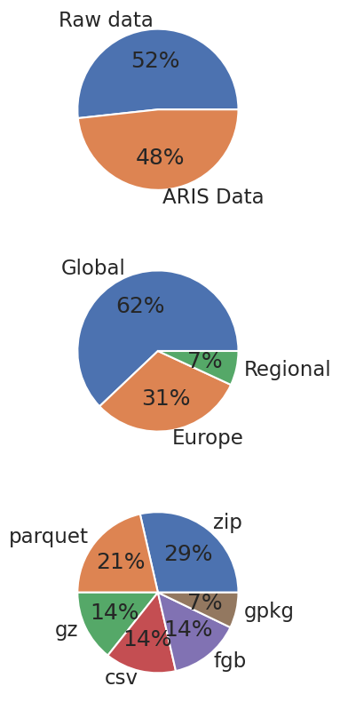

## Accessing in-situ data in OEMC STAC

The best way to access in-situ data in OEMC STAC is via [pystac library](https://pystac.readthedocs.io/en/stable/api/pystac.html). The current version is based on a static catalog (https://s3.eu-central-1.wasabisys.com/stac/oemc/catalog.json) presented in STAC Browser client (http://stac.earthmonitor.org).

Let's first create a Catalog object from the remote URL:


```python
import pystac 
STAC_URL = 'https://s3.eu-central-1.wasabisys.com/stac/oemc/catalog.json'
catalog = pystac.Catalog.from_file(STAC_URL)
```

... and now let's harvest all asset items for a [Pandas DataFrame](https://pandas.pydata.org/): 


```python
import pandas as pd 

df = []

for collection in catalog.get_collections():
    for item in collection.get_items(recursive=True):
        for key in item.assets.keys():
            if 'data' in item.assets[key].roles or 'external' in item.assets[key].roles:
                df.append({
                    'title': collection.title,
                    'description': collection.description,
                    'start_datetime': item.properties['start_datetime'],
                    'end_datetime': item.properties['end_datetime'],
                    'asset': item.assets[key].title,
                    'asset_url': item.assets[key].href,
                    'asset_type': item.assets[key].roles[0],
                    'keywords': collection.keywords
                })

df = pd.DataFrame(df)
                
df['type'] = df['asset_type'].map(lambda k:  'ARIS Data' if k == 'data' else 'Raw data')
df['region'] = df['keywords'].map(lambda k:  'Global' if 'global' in k else 'Europe' if 'europe' in k else 'Regional')
df['file_ext'] = df[df['type'] == 'ARIS Data']['asset_url'].map(lambda f: Path(f).suffix.replace('?download=1','').replace('869682?format=','').replace('.',''))
```

Using the DataFrame, it's possible to retrieve some summary info:


```python
print(f'Number of STAC datasets registered: {len(df.title.unique())}')
print(f'Number of STAC assets registered: {len(df.asset_url.unique())}')
```

    Number of STAC datasets registered: 13
    Number of STAC assets registered: 29


... and derive plots by dataset types, spatial coverage and file format:


```python
import seaborn as sns
from pathlib import Path
import matplotlib.pyplot as plt

sns.set_theme(context='talk', style="whitegrid")

fig, axes = plt.subplots(3, 1,  figsize=(10, 10))

df['type'].value_counts().plot(kind='pie', y='class', ylabel='', autopct='%1.0f%%', legend=False, ax=axes[0])
df['region'].value_counts().plot(kind='pie', y='class', ylabel='', autopct='%1.0f%%', legend=False, ax=axes[1])
df['file_ext'].value_counts().plot(kind='pie', y='class', ylabel='', autopct='%1.0f%%',legend=False, ax=axes[2])
```


    <Axes: >


    

    


## Data reading

For Parquet files, it's possible to retrieve all column information by lazy loading using [pyarrow](https://arrow.apache.org/docs/python/index.html)


```python
import pyarrow.parquet as pq
from urllib.parse import urlparse
from pyarrow import fs

for _, rows in df[df['file_ext'] == 'parquet'].iterrows(): 
    url = rows['asset_url']
    urlp = urlparse(url)
    #httpfs = fs.S3FileSystem(scheme=urlp.scheme, endpoint_override=urlp.netloc)
    #ds = pq.ParquetDataset(urlp.path[1:], filesystem=httpfs)
    print(f"Retriving column schema for {rows['title']} ")
    print(f"  URL: {url}")
    print(ds.schema)
    break

```

    Retriving column schema for OBIS: Ocean Biogeographic Information System 
      URL: https://obis-datasets.ams3.digitaloceanspaces.com/exports/obis_20231025.parquet
    id: string
    dataset_id: string
    decimalLongitude: float
    decimalLatitude: float
    date_start: int64
    date_mid: int64
    date_end: int64
    date_year: int64
    scientificName: string
    originalScientificName: string
    minimumDepthInMeters: float
    maximumDepthInMeters: float
    depth: float
    coordinateUncertaintyInMeters: float
    flags: string
    dropped: bool
    absence: bool
    shoredistance: string
    bathymetry: string
    sst: string
    sss: string
    marine: bool
    brackish: bool
    freshwater: bool
    terrestrial: bool
    taxonRank: string
    AphiaID: int64
    redlist_category: string
    superdomain: string
    domain: string
    kingdom: string
    subkingdom: string
    infrakingdom: string
    phylum: string
    phylum_division: string
    subphylum_subdivision: string
    subphylum: string
    infraphylum: string
    parvphylum: string
    gigaclass: string
    megaclass: string
    superclass: string
    class: string
    subclass: string
    infraclass: string
    subterclass: string
    superorder: string
    order: string
    suborder: string
    infraorder: string
    parvorder: string
    superfamily: string
    family: string
    subfamily: string
    supertribe: string
    tribe: string
    subtribe: string
    genus: string
    subgenus: string
    section: string
    subsection: string
    series: string
    species: string
    subspecies: string
    natio: string
    variety: string
    subvariety: string
    forma: string
    subforma: string
    superdomainid: int64
    domainid: int64
    kingdomid: int64
    subkingdomid: int64
    infrakingdomid: int64
    phylumid: int64
    phylum_divisionid: int64
    subphylum_subdivisionid: int64
    subphylumid: int64
    infraphylumid: int64
    parvphylumid: int64
    gigaclassid: int64
    megaclassid: int64
    superclassid: int64
    classid: int64
    subclassid: int64
    infraclassid: int64
    subterclassid: int64
    superorderid: int64
    orderid: int64
    suborderid: int64
    infraorderid: int64
    parvorderid: int64
    superfamilyid: int64
    familyid: int64
    subfamilyid: int64
    supertribeid: int64
    tribeid: int64
    subtribeid: int64
    genusid: int64
    subgenusid: int64
    sectionid: int64
    subsectionid: int64
    seriesid: int64
    speciesid: int64
    subspeciesid: int64
    natioid: int64
    varietyid: int64
    subvarietyid: int64
    formaid: int64
    subformaid: int64
    type: string
    modified: string
    language: string
    license: string
    rightsHolder: string
    accessRights: string
    bibliographicCitation: string
    references: string
    institutionID: string
    collectionID: string
    datasetID: string
    institutionCode: string
    collectionCode: string
    datasetName: string
    ownerInstitutionCode: string
    basisOfRecord: string
    informationWithheld: string
    dataGeneralizations: string
    dynamicProperties: string
    materialSampleID: string
    occurrenceID: string
    catalogNumber: string
    occurrenceRemarks: string
    recordNumber: string
    recordedBy: string
    recordedByID: string
    individualCount: string
    organismQuantity: string
    organismQuantityType: string
    sex: string
    lifeStage: string
    reproductiveCondition: string
    behavior: string
    establishmentMeans: string
    occurrenceStatus: string
    preparations: string
    disposition: string
    otherCatalogNumbers: string
    associatedMedia: string
    associatedReferences: string
    associatedSequences: string
    associatedTaxa: string
    organismID: string
    organismName: string
    organismScope: string
    associatedOccurrences: string
    associatedOrganisms: string
    previousIdentifications: string
    organismRemarks: string
    eventID: string
    parentEventID: string
    samplingProtocol: string
    sampleSizeValue: string
    sampleSizeUnit: string
    samplingEffort: string
    eventDate: string
    eventTime: string
    startDayOfYear: string
    endDayOfYear: string
    year: string
    month: string
    day: string
    verbatimEventDate: string
    habitat: string
    fieldNumber: string
    fieldNotes: string
    eventRemarks: string
    locationID: string
    higherGeographyID: string
    higherGeography: string
    continent: string
    waterBody: string
    islandGroup: string
    island: string
    country: string
    countryCode: string
    stateProvince: string
    county: string
    municipality: string
    locality: string
    verbatimLocality: string
    verbatimElevation: string
    minimumElevationInMeters: string
    maximumElevationInMeters: string
    verbatimDepth: string
    minimumDistanceAboveSurfaceInMeters: string
    maximumDistanceAboveSurfaceInMeters: string
    locationAccordingTo: string
    locationRemarks: string
    verbatimCoordinates: string
    verbatimLatitude: string
    verbatimLongitude: string
    verbatimCoordinateSystem: string
    verbatimSRS: string
    geodeticDatum: string
    coordinatePrecision: string
    pointRadiusSpatialFit: string
    footprintWKT: string
    footprintSRS: string
    footprintSpatialFit: string
    georeferencedBy: string
    georeferencedDate: string
    georeferenceProtocol: string
    georeferenceSources: string
    georeferenceVerificationStatus: string
    georeferenceRemarks: string
    geologicalContextID: string
    earliestEonOrLowestEonothem: string
    latestEonOrHighestEonothem: string
    earliestEraOrLowestErathem: string
    latestEraOrHighestErathem: string
    earliestPeriodOrLowestSystem: string
    latestPeriodOrHighestSystem: string
    earliestEpochOrLowestSeries: string
    latestEpochOrHighestSeries: string
    earliestAgeOrLowestStage: string
    latestAgeOrHighestStage: string
    lowestBiostratigraphicZone: string
    highestBiostratigraphicZone: string
    lithostratigraphicTerms: string
    group: string
    formation: string
    member: string
    bed: string
    identificationID: string
    identifiedBy: string
    identifiedByID: string
    dateIdentified: string
    identificationReferences: string
    identificationRemarks: string
    identificationQualifier: string
    identificationVerificationStatus: string
    typeStatus: string
    taxonID: string
    scientificNameID: string
    acceptedNameUsageID: string
    parentNameUsageID: string
    originalNameUsageID: string
    nameAccordingToID: string
    namePublishedInID: string
    taxonConceptID: string
    acceptedNameUsage: string
    parentNameUsage: string
    originalNameUsage: string
    nameAccordingTo: string
    namePublishedIn: string
    namePublishedInYear: string
    higherClassification: string
    specificEpithet: string
    infraspecificEpithet: string
    verbatimTaxonRank: string
    scientificNameAuthorship: string
    vernacularName: string
    nomenclaturalCode: string
    taxonomicStatus: string
    nomenclaturalStatus: string
    taxonRemarks: string
    geometry: string

